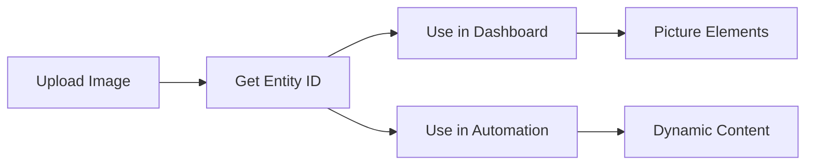

# Usage Guide - Image Manager Integration

This comprehensive guide covers all aspects of using the Image Manager integration, from basic card configuration to advanced automation scenarios.

## Table of Contents

- [Getting Started](#getting-started)
- [Lovelace Card Usage](#lovelace-card-usage)
- [Service Calls](#service-calls)
- [Entity Usage](#entity-usage)
- [Automation Examples](#automation-examples)
- [Picture-Element Integration](#picture-element-integration)
- [Advanced Configurations](#advanced-configurations)
- [Best Practices](#best-practices)
- [Performance Optimization](#performance-optimization)

## Getting Started

### First Steps

After installation, follow these steps to start using the Image Manager:

1. **Add the card to your dashboard**
2. **Upload your first 4K image**
3. **Copy the generated entity ID**
4. **Use the image in other cards or automations**

### Basic Workflow



## Lovelace Card Usage

### Basic Card Configuration

Add the Image Manager card to any dashboard:

```yaml
type: custom:image-manager-card
title: "Image Gallery"
```

### Complete Configuration Options

```yaml
type: custom:image-manager-card
title: "4K Image Manager"           # Card title
show_upload: true                   # Show upload interface
show_gallery: true                  # Show image thumbnails
show_entities: true                 # Show entity ID list
columns: 3                          # Gallery columns (1-6)
thumbnail_size: 150                 # Thumbnail height (100, 150, 200, 250)
```

### Configuration Examples

#### Minimal Upload-Only Card
```yaml
type: custom:image-manager-card
title: "Quick Upload"
show_upload: true
show_gallery: false
show_entities: false
```

#### Gallery-Only Display
```yaml
type: custom:image-manager-card
title: "Image Gallery"
show_upload: false
show_gallery: true
show_entities: true
columns: 4
thumbnail_size: 200
```

#### Compact Management Card
```yaml
type: custom:image-manager-card
title: "Images"
columns: 6
thumbnail_size: 100
```

### Card Features

#### Upload Interface
- **Drag & Drop**: Drag image files onto the upload area
- **File Browser**: Click to open file selection dialog
- **Multiple Upload**: Select multiple files at once
- **Progress Feedback**: Real-time upload progress
- **Validation**: Automatic 4K dimension checking

#### Gallery Management
- **Thumbnail Grid**: Responsive image grid
- **Hover Actions**: Copy URL and delete buttons
- **Image Info**: Filename and sequence display
- **Bulk Actions**: Clear all images option

#### Entity Integration
- **Entity IDs**: Copy `image.image_manager_X` IDs
- **Direct URLs**: Copy `/api/image_manager/images/X` URLs
- **Refresh**: Manual refresh of image list

## Service Calls

### Upload Image Service

Upload images programmatically using base64 data:

```yaml
service: image_manager.upload_image
data:
  image_data: "{{ states('sensor.camera_snapshot_b64') }}"
  filename: "security_camera_{{ now().strftime('%Y%m%d_%H%M%S') }}.jpg"
```

#### Service Parameters
- `image_data` (required): Base64 encoded image data
- `filename` (optional): Custom filename for the image

#### Example with File Template
```yaml
service: image_manager.upload_image
data:
  image_data: "{{ state_attr('camera.front_door', 'entity_picture') | regex_replace('.*,(.*)','\\1') }}"
  filename: "front_door_{{ now().strftime('%Y%m%d_%H%M%S') }}.jpg"
```

### Delete Image Service

Remove specific images by sequence number:

```yaml
service: image_manager.delete_image
data:
  sequence: 1
```

#### Dynamic Deletion
```yaml
service: image_manager.delete_image
data:
  sequence: "{{ states('input_number.image_to_delete') | int }}"
```

### Delete All Images Service

Clear all stored images:

```yaml
service: image_manager.delete_all_images
```

## Entity Usage

### Image Entities

Each uploaded image creates an entity with the pattern:
- **Entity ID**: `image.image_manager_1`, `image.image_manager_2`, etc.
- **Entity Name**: "Image Manager 1", "Image Manager 2", etc.
- **State**: URL path to the image
- **Attributes**: Filename, upload timestamp, file hash

### Using Entities in Templates

#### Get Image URL
```yaml
sensor:
  - platform: template
    sensors:
      current_background:
        value_template: "{{ state_attr('image.image_manager_1', 'entity_picture') }}"
```

#### Check Image Availability
```yaml
binary_sensor:
  - platform: template
    sensors:
      image_available:
        value_template: "{{ states('image.image_manager_1') != 'unavailable' }}"
```

#### Get Image Metadata
```yaml
sensor:
  - platform: template
    sensors:
      image_filename:
        value_template: "{{ state_attr('image.image_manager_1', 'filename') }}"
      image_upload_time:
        value_template: "{{ state_attr('image.image_manager_1', 'uploaded_at') }}"
```

## Automation Examples

### Dynamic Background Rotation

Rotate dashboard backgrounds based on time of day:

```yaml
automation:
  - alias: "Morning Background"
    trigger:
      - platform: time
        at: "06:00:00"
    action:
      - service: image_manager.upload_image
        data:
          image_data: "{{ states('sensor.morning_image_b64') }}"
          filename: "morning_{{ now().strftime('%Y%m%d') }}.jpg"

  - alias: "Evening Background"
    trigger:
      - platform: time
        at: "18:00:00"
    action:
      - service: image_manager.upload_image
        data:
          image_data: "{{ states('sensor.evening_image_b64') }}"
          filename: "evening_{{ now().strftime('%Y%m%d') }}.jpg"
```

### Security Camera Snapshots

Automatically capture and store security camera snapshots:

```yaml
automation:
  - alias: "Motion Detected - Save Snapshot"
    trigger:
      - platform: state
        entity_id: binary_sensor.front_door_motion
        to: "on"
    action:
      - service: camera.snapshot
        target:
          entity_id: camera.front_door
        data:
          filename: "/tmp/motion_snapshot.jpg"
      - delay: "00:00:02"
      - service: image_manager.upload_image
        data:
          image_data: "{{ (('/tmp/motion_snapshot.jpg') | file_base64) }}"
          filename: "motion_{{ now().strftime('%Y%m%d_%H%M%S') }}.jpg"
```

### Weather-Based Backgrounds

Change backgrounds based on weather conditions:

```yaml
automation:
  - alias: "Weather Background Update"
    trigger:
      - platform: state
        entity_id: weather.home
        attribute: condition
    condition:
      - condition: template
        value_template: "{{ trigger.to_state.attributes.condition != trigger.from_state.attributes.condition }}"
    action:
      - service: image_manager.upload_image
        data:
          image_data: "{{ states('sensor.weather_background_' + states('weather.home')) }}"
          filename: "weather_{{ states('weather.home') }}_{{ now().strftime('%Y%m%d') }}.jpg"
```

### Scheduled Image Cleanup

Automatically manage storage by deleting old images:

```yaml
automation:
  - alias: "Weekly Image Cleanup"
    trigger:
      - platform: time
        at: "02:00:00"
    condition:
      - condition: time
        weekday:
          - sun
    action:
      - service: image_manager.delete_all_images
      - delay: "00:00:05"
      - service: image_manager.upload_image
        data:
          image_data: "{{ states('sensor.default_background_b64') }}"
          filename: "default_background.jpg"
```

## Picture-Element Integration

### Basic Picture-Element Card

Use Image Manager images as backgrounds for interactive cards:

```yaml
type: picture-elements
image: /api/image_manager/images/1
elements:
  - type: state-label
    entity: sensor.living_room_temperature
    style:
      top: 20%
      left: 30%
      color: white
      font-size: 24px
  - type: state-icon
    entity: light.living_room
    tap_action:
      action: toggle
    style:
      top: 50%
      left: 70%
      --iron-icon-height: 40px
      --iron-icon-width: 40px
```

### Dynamic Picture-Element

Change the background image based on conditions:

```yaml
type: picture-elements
image: >
  
    /api/image_manager/images/1
  
    /api/image_manager/images/2
  
elements:
  - type: conditional
    conditions:
      - entity: light.living_room
        state: "on"
    elements:
      - type: icon
        icon: mdi:lightbulb-on
        style:
          top: 30%
          left: 50%
```

### Floor Plan Integration

Create interactive floor plans with Image Manager:

```yaml
type: picture-elements
image: /api/image_manager/images/3  # Floor plan image
elements:
  # Living Room
  - type: state-icon
    entity: light.living_room
    tap_action:
      action: toggle
    style:
      top: 25%
      left: 30%
  
  # Kitchen
  - type: state-icon
    entity: light.kitchen
    tap_action:
      action: toggle
    style:
      top: 45%
      left: 60%
  
  # Temperature Sensors
  - type: state-label
    entity: sensor.living_room_temperature
    style:
      top: 35%
      left: 30%
      color: "#ffffff"
      background-color: "rgba(0,0,0,0.5)"
      padding: "5px"
      border-radius: "5px"
```

## Advanced Configurations

### Multiple Image Manager Instances

Configure multiple instances for different purposes:

```yaml
# configuration.yaml
image_manager:
  - name: "Security Images"
    max_images: 50
  - name: "Dashboard Backgrounds"
    max_images: 10
  - name: "Weather Images"
    max_images: 20
```

### Custom Storage Paths

Use different storage locations:

```yaml
# configuration.yaml
image_manager:
  storage_path: "/config/custom_images"
  max_images: 100
```

### Integration with Node-RED

Use with Node-RED for advanced image processing:

```javascript
// Node-RED function node
const imageData = msg.payload.image_base64;
const filename = `processed_${Date.now()}.jpg`;

msg.payload = {
    service: "image_manager.upload_image",
    data: {
        image_data: imageData,
        filename: filename
    }
};

return msg;
```

### REST API Usage

Direct API calls for external integrations:

```bash
# Upload image via API
curl -X POST \
  http://your-ha-url:8123/api/image_manager/upload \
  -H "Authorization: Bearer YOUR_TOKEN" \
  -H "Content-Type: application/json" \
  -d '{
    "image_data": "base64_encoded_image_data",
    "filename": "api_upload.jpg"
  }'

# Get status
curl -X GET \
  http://your-ha-url:8123/api/image_manager/status \
  -H "Authorization: Bearer YOUR_TOKEN"
```

## Best Practices

### Image Preparation

#### Optimal Image Specifications
- **Resolution**: Exactly 3840×2160 pixels
- **Format**: JPEG for smaller file sizes, PNG for transparency
- **Quality**: 85-95% JPEG quality for best size/quality balance
- **Color Space**: sRGB for web compatibility

#### Image Optimization Tools
```bash
# Using ImageMagick to prepare images
convert input.jpg -resize 3840x2160! -quality 90 output.jpg

# Using FFmpeg for video frame extraction
ffmpeg -i video.mp4 -vf scale=3840:2160 -q:v 2 frame_%03d.jpg
```

### Storage Management

#### Monitor Storage Usage
```yaml
sensor:
  - platform: template
    sensors:
      image_storage_usage:
        value_template: "{{ states('sensor.image_manager_count') }}/25"
        unit_of_measurement: "images"
```

#### Automated Cleanup Strategy
```yaml
automation:
  - alias: "Storage Full Warning"
    trigger:
      - platform: numeric_state
        entity_id: sensor.image_manager_count
        above: 20
    action:
      - service: notify.mobile_app
        data:
          message: "Image Manager storage is nearly full ({{ states('sensor.image_manager_count') }}/25)"
```

### Performance Optimization

#### Efficient Card Configuration
```yaml
# For large galleries, use smaller thumbnails
type: custom:image-manager-card
columns: 6
thumbnail_size: 100
show_entities: false  # Hide if not needed
```

#### Lazy Loading Implementation
```yaml
# Use conditional cards for better performance
type: conditional
conditions:
  - entity: input_boolean.show_image_gallery
    state: "on"
card:
  type: custom:image-manager-card
  columns: 4
```

### Security Considerations

#### Access Control
- Images are served through Home Assistant's authentication system
- API endpoints require valid authentication tokens
- No external access without proper Home Assistant security setup

#### File Validation
- All uploads are validated for format and dimensions
- File size limits prevent storage exhaustion
- Hash verification prevents duplicate uploads

## Performance Optimization

### Browser Performance

#### Optimize Card Loading
```yaml
# Use smaller thumbnail sizes for better performance
type: custom:image-manager-card
thumbnail_size: 100
columns: 6
```

#### Conditional Display
```yaml
# Only show gallery when needed
type: conditional
conditions:
  - entity: input_boolean.show_images
    state: "on"
card:
  type: custom:image-manager-card
  show_upload: false
  show_gallery: true
```

### Server Performance

#### Storage Optimization
- Use JPEG format for smaller file sizes
- Implement regular cleanup routines
- Monitor disk space usage

#### Memory Management
- Limit concurrent uploads
- Use appropriate image quality settings
- Consider storage location (SSD vs HDD)

### Network Optimization

#### Efficient Image Serving
- Images are served with appropriate cache headers
- Direct URL access for external applications
- Optimized thumbnail generation

## Troubleshooting Usage Issues

### Common Problems

#### Images Not Displaying
1. Check entity state: `{{ states('image.image_manager_1') }}`
2. Verify URL accessibility: `/api/image_manager/images/1`
3. Clear browser cache

#### Upload Failures
1. Verify image dimensions (3840×2160)
2. Check file format (JPEG/PNG)
3. Ensure storage isn't full

#### Service Call Errors
1. Validate base64 data format
2. Check service parameters
3. Review Home Assistant logs

### Debug Templates

Test image availability:
```yaml
# Developer Tools > Templates
{{ states('image.image_manager_1') }}
{{ state_attr('image.image_manager_1', 'entity_picture') }}
{{ state_attr('image.image_manager_1', 'filename') }}
```

## Next Steps

After mastering the basics:

1. **Explore automation possibilities** with dynamic image management
2. **Create interactive floor plans** using picture-element cards
3. **Integrate with external systems** using the REST API
4. **Optimize performance** for your specific use case
5. **Check the [Troubleshooting Guide](TROUBLESHOOTING.md)** for advanced issues

---

**Ready to create amazing visual experiences with your 4K images!**